# JWT Under Different Secret Strategies 

## 1. JWT with Static Secret (HS256)

### Token Creation Flow

### Token Verification Flow

### Static Secret Security Model

```mermaid
graph TD
    A[Static Secret Generated Once] --> B{Secret Distribution}
    B --> C[Auth Server]
    B --> D[API Server 1]
    B --> E[API Server 2]
    B --> F[All Services]
    
    G[Secret Leak Scenario] --> H{Impact}
    H --> I[❌ ALL tokens compromised]
    H --> J[❌ Attacker can create fake tokens]
    H --> K[❌ Must invalidate ALL tokens]
    H --> L[❌ Must rotate secret immediately]
    
    style G fill:#5e4d01
    style I fill:#5e4d01
    style J fill:#5e4d01
    style K fill:#5e4d01
    style L fill:#5e4d01
```

---

## 2. JWT with Dynamic/Rotational Secret

### Secret Rotation Timeline

### Multi-Secret Verification Flow

```mermaid
sequenceDiagram
    participant Client
    participant Server
    participant V3 as Current Secret<br/>(V3)
    participant V2 as Previous Secret<br/>(V2)
    participant V1 as Old Secret<br/>(V1)
    
    Client->>Server: GET /profile<br/>Authorization: Bearer token
    activate Server
    
    Server->>V3: Try current secret (V3)
    
    alt Verified with V3
        V3-->>Server: ✅ Valid signature
        Server-->>Client: {profile data}
    else V3 fails
        Server->>V2: Try previous secret (V2)
        
        alt Verified with V2
            V2-->>Server: ⚠️ Valid but OLD
            Server->>Server: Log warning:<br/>"Token using old secret V2"
            Server-->>Client: {profile data}
        else V2 fails
            Server->>V1: Try old secret (V1)
            
            alt Verified with V1
                V1-->>Server: ⚠️ Valid but VERY OLD
                Server->>Server: Log warning:<br/>"Token using very old secret V1"
                Server-->>Client: {profile data}
            else All secrets fail
                Server-->>Client: 403 Invalid token
            end
        end
    end
    
    deactivate Server
```

### Secret Rotation Strategy

```mermaid
graph TB
    subgraph "Day 0 - Initial Setup"
        A1[Active: V1]
        A2[Previous: none]
    end
    
    subgraph "Day 30 - First Rotation"
        B1[Active: V2 ← NEW]
        B2[Previous: V1]
        B3[New tokens: V2]
        B4[Old tokens: V1 still valid]
    end
    
    subgraph "Day 60 - Second Rotation"
        C1[Active: V3 ← NEW]
        C2[Previous: V2, V1]
        C3[New tokens: V3]
        C4[Old tokens: V2, V1 valid]
    end
    
    subgraph "Day 90 - Third Rotation"
        D1[Active: V4 ← NEW]
        D2[Previous: V3, V2]
        D3[❌ V1 REMOVED]
        D4[V1 tokens now INVALID]
    end
    
    A1 --> B1
    A2 --> B2
    B1 --> C1
    B2 --> C2
    C1 --> D1
    C2 --> D2
    
    style D3 fill:#5e4d01
    style D4 fill:#5e4d01
```

### Compromised Secret Handling

---

## 3. JWT with Symmetric Encryption (HS256)

### HMAC-SHA256 Signing Process

### Symmetric Key Distribution

```mermaid
graph TB
    subgraph "Secret Distribution"
        Secret[Same Secret Key<br/>'a1b2c3d4...']
    end
    
    Secret --> Auth[Auth Service<br/>🔑 Creates tokens]
    Secret --> API1[API Server 1<br/>🔑 Verifies tokens]
    Secret --> API2[API Server 2<br/>🔑 Verifies tokens]
    Secret --> API3[API Server 3<br/>🔑 Verifies tokens]
    
    Auth --> Token[Token Created]
    Token --> LB[Load Balancer]
    
    LB --> API1
    LB --> API2
    LB --> API3
    
    API1 --> Verify1[✅ Can verify]
    API2 --> Verify2[✅ Can verify]
    API3 --> Verify3[✅ Can verify]
    
    API1 -.->|⚠️ Can also create| Forge1[Can forge tokens]
    API2 -.->|⚠️ Can also create| Forge2[Can forge tokens]
    API3 -.->|⚠️ Can also create| Forge3[Can forge tokens]
    
    style Secret fill:#025451
    style Forge1 fill:#5e4d01
    style Forge2 fill:#5e4d01
    style Forge3 fill:#5e4d01
```

### HS256 Complete Flow

---

## 4. JWT with Asymmetric Encryption (RS256)

### RSA Key Pair Generation

```mermaid
flowchart LR
    A[Generate RSA Key Pair] --> B[Private Key<br/>2048-bit]
    A --> C[Public Key<br/>2048-bit]
    
    B --> D[Components:<br/>• Modulus n = p × q<br/>• Private exp d SECRET<br/>• Public exp e = 65537]
    
    C --> E[Components:<br/>• Modulus n SAME<br/>• Public exp e = 65537]
    
    D --> F[🔐 Keep SECRET<br/>Only Auth Service]
    E --> G[🔓 Share PUBLICLY<br/>All Services]
    
    style F fill:#5e4d01
    style G fill:#044716
```

### RS256 Signing Process

### RS256 Verification Process

```mermaid
flowchart TD
    A[Received Token] --> B[Split into parts]
    B --> C[header.payload.signature]
    
    C --> D[Hash the data]
    D --> E["computedHash = SHA-256(header.payload)"]
    
    C --> F[Decode signature]
    F --> G[256-byte signature]
    
    H[Public Key<br/>Modulus n<br/>Public exp e] --> I["RSA Operation:<br/>decrypted = sig^e mod n"]
    G --> I
    
    I --> J[Remove PKCS#1 Padding]
    J --> K[extractedHash<br/>32 bytes]
    
    E --> L{Compare Hashes}
    K --> L
    
    L -->|Match| M[✅ Valid Signature<br/>Token created by<br/>private key holder]
    L -->|Mismatch| N[❌ Invalid Signature<br/>Tampered or forged]
    
    style H fill:#044716
    style M fill:#044716
    style N fill:#5e4d01
```

### Asymmetric Key Distribution in Microservices

### RS256 Complete Workflow

```mermaid
sequenceDiagram
    participant Client
    participant Auth as Auth Service<br/>🔐 Private Key
    participant API as API Service<br/>🔓 Public Key
    participant Partner as External Partner<br/>🔓 Public Key
    
    Note over Client,Partner: TOKEN CREATION (Auth Only)
    
    Client->>Auth: POST /login
    activate Auth
    Auth->>Auth: Validate credentials
    Auth->>Auth: Create payload
    Auth->>Auth: SHA-256 hash of data
    Auth->>Auth: Sign with PRIVATE KEY<br/>sig = hash^d mod n
    Auth->>Auth: Combine: header.payload.signature
    Auth-->>Client: {token: "eyJhbGci..."}
    deactivate Auth
    
    Note over Client,Partner: TOKEN VERIFICATION (Anyone)
    
    Client->>API: GET /profile<br/>Authorization: Bearer token
    activate API
    API->>API: Hash received data
    API->>API: "Decrypt" signature with PUBLIC KEY<br/>hash = sig^e mod n
    API->>API: Compare hashes
    API-->>Client: ✅ {profile data}
    deactivate API
    
    Client->>Partner: GET /data<br/>Authorization: Bearer token
    activate Partner
    Partner->>Partner: Hash received data
    Partner->>Partner: "Decrypt" signature with PUBLIC KEY
    Partner->>Partner: Compare hashes
    Partner-->>Client: ✅ {partner data}
    deactivate Partner
    
    Note over Client,Partner: Security: Only Auth can CREATE tokens<br/>Everyone can VERIFY tokens
```

### RSA Mathematical Foundation

```mermaid
flowchart TB
    A[Choose large primes p, q] --> B["Modulus: n = p × q<br/>(2048 bits)"]
    
    B --> C["Public exponent: e = 65537<br/>(commonly used)"]
    
    B --> D["Private exponent: d<br/>where e × d ≡ 1 (mod φ(n))"]
    
    E[Public Key: n, e] --> F[Can verify signatures]
    G[Private Key: n, d] --> H[Can create signatures]
    
    I[Signing:<br/>signature = hash^d mod n] --> J[Only private key holder]
    
    K[Verification:<br/>hash = signature^e mod n] --> L[Anyone with public key]
    
    M[Security:<br/>Finding d from n, e<br/>requires factoring n] --> N[Computationally infeasible<br/>~300 trillion years<br/>for 2048-bit keys]
    
    style G fill:#5e4d01
    style E fill:#044716
    style N fill:#044716
```

---

## Comparison: HS256 vs RS256

### Performance Comparison

### Security Model Comparison

```mermaid
flowchart TB
    subgraph "HS256 - Symmetric"
        A[Same Secret Everywhere]
        A --> A1[✅ Fast]
        A --> A2[✅ Simple]
        A --> A3[❌ Secret shared with all]
        A --> A4[❌ Anyone with secret<br/>can create tokens]
        A --> A5[❌ One compromise = all compromised]
    end
    
    subgraph "RS256 - Asymmetric"
        B[Private/Public Key Pair]
        B --> B1[❌ Slower]
        B --> B2[❌ More complex]
        B --> B3[✅ Public key shared<br/>Private key secret]
        B --> B4[✅ Only private key holder<br/>can create tokens]
        B --> B5[✅ API compromise ≠<br/>ability to forge tokens]
    end
    
    style A3 fill:#5e4d01
    style A4 fill:#5e4d01
    style A5 fill:#5e4d01
    style B3 fill:#044716
    style B4 fill:#044716
    style B5 fill:#044716
```

### Use Case Decision Tree

```mermaid
flowchart TD
    A{What type of<br/>architecture?} -->|Monolithic/<br/>Single service| B[HS256<br/>Symmetric]
    
    A -->|Microservices/<br/>Distributed| C{Need external<br/>verification?}
    
    C -->|No, internal only| D{Trust all<br/>services equally?}
    C -->|Yes, third-party| E[RS256<br/>Asymmetric]
    
    D -->|Yes| F[HS256<br/>Symmetric<br/>with rotation]
    D -->|No| E
    
    B --> B1[✅ Fast<br/>✅ Simple<br/>⚠️ Secure secret storage]
    
    F --> F1[✅ Fast<br/>✅ Simple<br/>✅ Rotation strategy<br/>⚠️ Secure distribution]
    
    E --> E1[✅ Best security<br/>✅ Public verification<br/>⚠️ Slower<br/>⚠️ Larger tokens]
    
    style B fill:#044716
    style F fill:#022f6e
    style E fill:#025451
```

